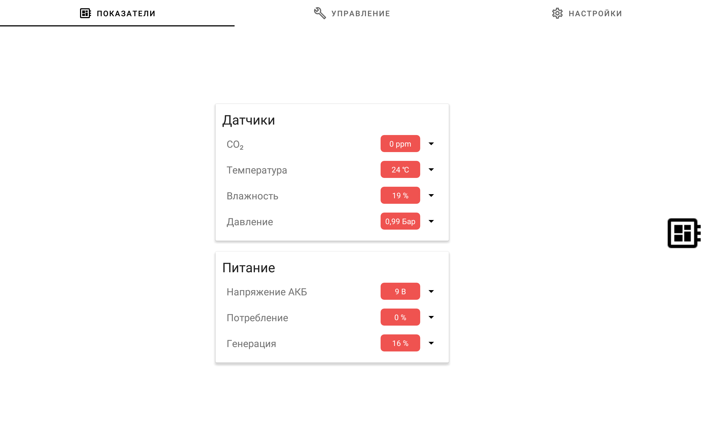
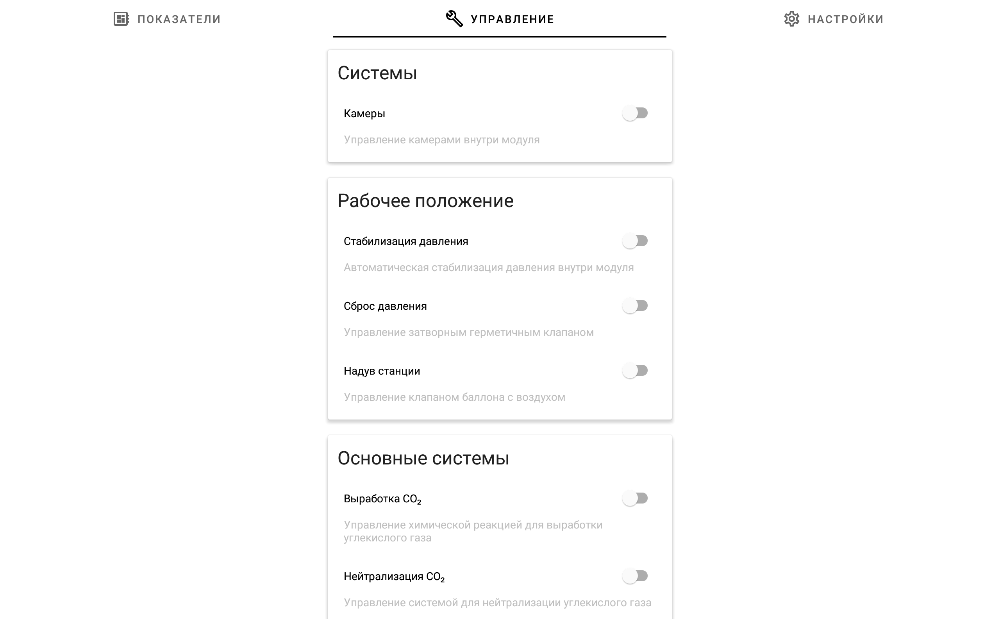
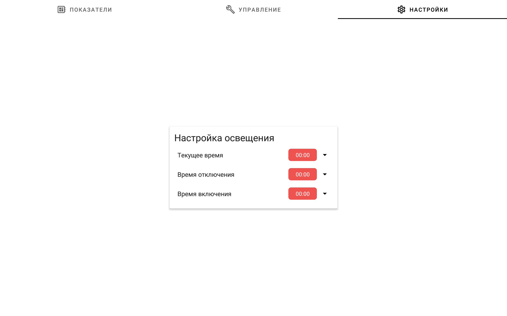

# Восток-27

## О компоненте

Панель управления под Android, для модуля «Восток-27».

## Скриншоты

  

## О проекте

Раздуваемый модуль космической станции «Восток-27» — проект реализованный в рамках ICCET Kvantoriada '19.

## Архитектура

Архитектура Slave ⇄ Master.

Arduino выступает зависимым *Slave*, который не выполняет действий без команд со стороны *Master*.

В качестве *Master* выступает любое другое Bluetooth устройство, которое реализует протокол. В рамках проекта таковым выступает любое Android устройство с приложением. [Подробнее здесь](https://github.com/sqxx/vostok-27-control-panel).

## Протокол

Протокол обмена данными представляет возможность реализовать обработку 256 команд с размером передачи данных до 4 байт. Подробное описание протокола и системы команд, реализуемой контроллером, можно [посмотреть здесь](./Docs/Protocol.md).

Приложение не полностью реализует описанный протокол на данный момент.